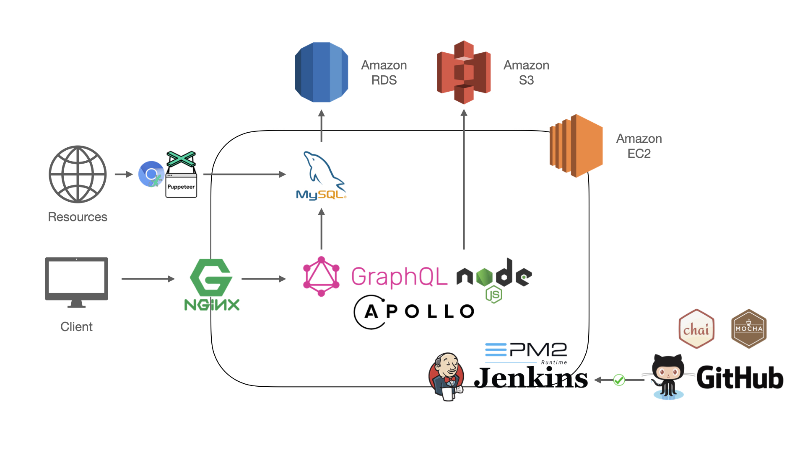
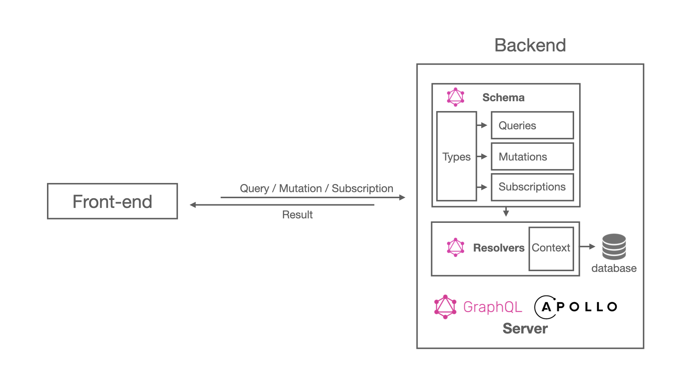
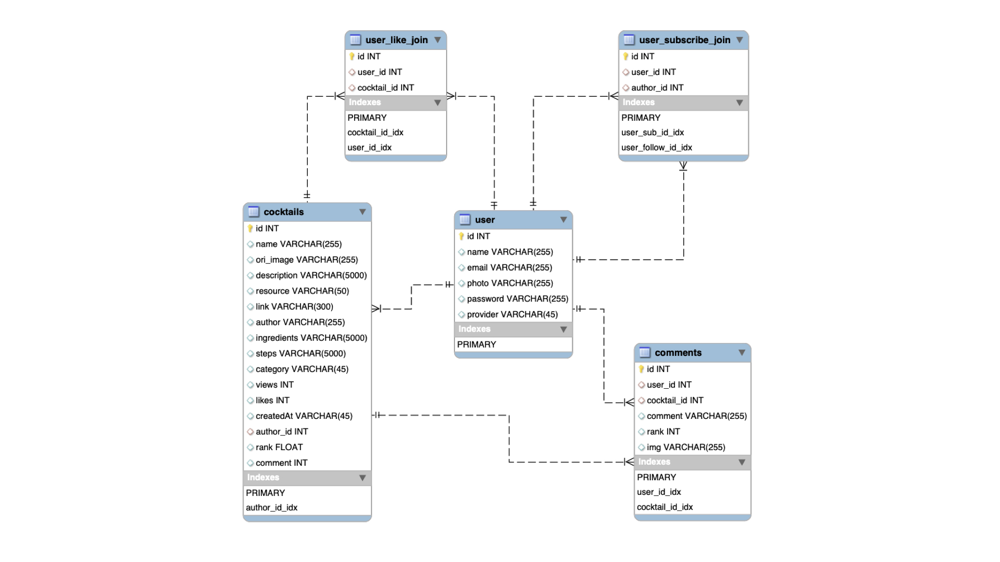

# Tonight

Tonight is a night-chill web platform for users to grab a cocktail recipe with recommendations and search function. People could like, comment, subscribe to posters, and share their awesome cocktail recipes as a social system.

* test account : tonight@demo.com
* password : tonightTestPasswords

## Table of Contents
* [Main Features](#main-features)
* [Technologies](#Technologies)
* [Structures](#Structures)
* [Database design](#database-design)
* [Inspiration](#Inspiration)
* [Contact](#Contact)

Pina colada

## Main Features

* Recommendation
    * Show top three selection on home page(likes,views,newest)

* Cocktails search
    * Support categories select options.
    * Search by ingredients and Author name.
* Cocktail detail recommendation
    * Recommend three cock related to the same category.  
    

* Membership system
    * Users could sign up and upload a personal photo. The profile page would show what users posted, liked and what they following and their followers. 

* Cocktail likes
    * Members could like the recipes.
* Subscription system
    * Members could follow recipes author.

* Cocktail comment 
    * Members could rank the recipes and upload the cocktail they made.

* Create recipe
    * Members could create their recipes.

 

## Technologies

### Backend

* Node.js / Express.js
* GrapQL API
* Apollo 
* NGINX
* PM2

### Frontend

* HTML/CSS/JavaScript
* jQuery
* Bootstrap

### Cloud Service (AWS)

* Compute: EC2
* Storage: S3
* Database: RDS

### Database

* MySQL
* AWS RDS

### Networking

* HTTP & HTTPS
* Domain Name System (DNS)
* SSL Certificate (Cloudfare)

### Test

* Mocha
* Chia
* Supertest 

### Tools

* Version Control: Git, GitHub
* CI / CD: Jenkins, Docker
* Agile: Trello (Scrum)

### Others

* AWS S3
* Dataloader
* JWT encrypt
* Design Pattern: MC
* Web Crawler: puppeteer

# Structures

## Backend Structure

## GraphQL API Structure

## Database design

# Inspiration
Project inspired by [TipsyBartender](https://tipsybartender.com/) and [Instagram](https://www.instagram.com/), recipes based on [TipsyBartender](https://tipsybartender.com/) and [allrecipes](https://www.allrecipes.com/)

# Contact
## Author
Ying Chi (Inch) Chen [@Inchtw](https://github.com/Inchtw)

Email : ashin1207@gmail.com
