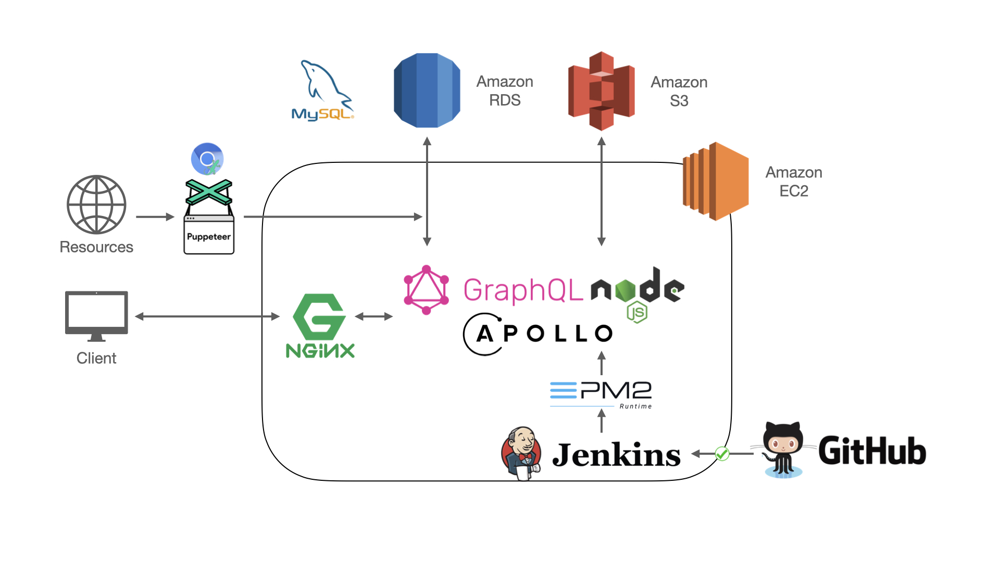

# [Tonight](https://tonight-drink.website/)

Tonight is a cocktail community where you can search cocktail recipe and get recommendations. Tonight, a wonderland where you can share your unique cocktails.

* Link : https://tonight-drink.website
* [Test account](https://tonight-drink.website/login.html) : tonight@demo.com
* Password : tonightTestPasswords

## Table of Contents
* [Main Features](#main-features)
* [Technologies](#Technologies)
* [Structures](#Structures)
* [Database design](#database-design)
* [Inspiration](#Inspiration)
* [Contact](#Contact)

## Main Features

* Recommendation
    * Show top three selection on home page(likes,views,newest)

* Cocktails search
    * Support categories select options.
    * Search by ingredients and Author name.
* Cocktail detail recommendation
    * Recommend three cock related to the same category.

* Membership system
    * Users could sign up and upload a personal photo. The profile page would show what users posted, liked and what they following and their followers.

* Cocktail likes
    * Members could like the recipes.
* Subscription system
    * Members could follow recipes author.

* Cocktail comment
    * Members could rank the recipes and upload the cocktail they made.

* Create recipe
    * Members could create their recipes.

## Technologies

### Backend

* Node.js / Express.js
* GrapQL API
* Apollo
* NGINX
* PM2

### Frontend

* HTML/CSS/JavaScript
* jQuery
* Bootstrap

### Cloud Service (AWS)

* Compute: EC2
* Storage: S3
* Database: RDS

### Database

* MySQL
* AWS RDS

### Networking

* HTTP & HTTPS
* Domain Name System (DNS)
* SSL Certificate (Cloudfare)

### Test

* Mocha
* Chia
* Supertest

### Tools

* Version Control: Git, GitHub
* CI / CD: Jenkins, Docker
* Agile: Trello (Scrum)

### Others

* AWS S3
* Dataloader
* JWT encrypt
* Design Pattern: MC
* Web Crawler: puppeteer

# Structures

## Backend Structure

## GraphQL API Structure

## Database design

# Inspiration
Project inspired by [TipsyBartender](https://tipsybartender.com/) and [Instagram](https://www.instagram.com/), recipes based on [TipsyBartender](https://tipsybartender.com/) and [allrecipes](https://www.allrecipes.com/)

# Contact
Ying Chi (Inch) Chen [@Inchtw](https://github.com/Inchtw)

Email : ashin1207@gmail.com
